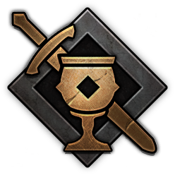
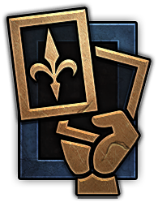
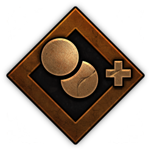
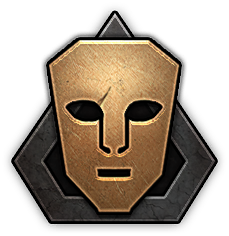
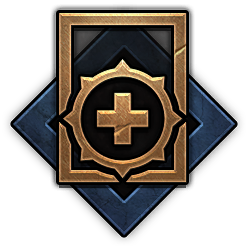

 

# TP2 Paradigmas De la Programacion

Trabajo Práctico número 2 de la materia Paradigmas de la Programacion de FIUBA

## Grupo {05}

* **Integrante 1** - [Iñaki Vydra]
* **Integrante 2** - [Aksel Mendoza]
* **Integrante 3** - [Nahuel Giner]
* **Integrante 4** - [Miguel Zorrilla]
* **Integrante 5** - [Sebastian Colazo]

Corrector: **Profesor Diego Sanchez**

## Como Ejecutar el Juego
Para ejecutar el programa y poder inicializar el juego, se pueden hacer dos maneras...

### Por terminal:
Desde el archivo base 'ParadigmasTP2' ejecutar el siguiente comando:

    mvn clean javafx:run

Esto iniciara el juego con el menu inicial, dando la bienvenida.

### Desde IntelliJ IDEA:

Simplemente hay que ir al archivo Main que se encuentra en:

    src/main/java/edu.fiuba.algo3/Main
Y desde alli simplemente hay que darle a Run 'Main.java'

## Forma de Jugar
#### Pequeño apartado en donde se explican las mecanicas basicas del juego de cartas, se recomienda leer para entender todo mejor.

Al iniciar se da una pequeña bienvenida y se solicita el nombre del jugador 1 y 2.
El jugador 1 posee la zona infierior mientras que el jugador 2 posee la zona superior.

Ambos jugadores empiezan con 10 cartas aleatorias de su mazo (15 Unidades y 6 Especiales).

En cada turno se puede jugar una unidad, una especial o terminar su participacion, al seleccionar esta ultima, el jugador no podra hacer nada hasta que termine esa ronda.

Cuando ambos jugadores terminan su participacion la ronda termina, dando como ganador aquel que acumule mas puntos entre sus tres seciones, en caso de empate la victoria no cuenta para nadie.

Unicamente se puede jugar una carta especial por jugador en cada ronda (excepto TiempoDespejado que sirve unicamente para limpiar climas).

Gana aquel jugador que llega primero a las dos rondas ganadas.

## Modificadores

  <strong>Legendaria: no es afectada por otros modificadores, tienen el puntaje fijo,
generalmente valores altos</strong>
  

  <strong>Ágil: se pueden ubicar en dos o más secciones, por ejemplo, algún
hechicero en cuerpo a cuerpo o distancia</strong>
  

  <strong>Animador: le sumas +1 a todas las cartas de una seccion </strong>
  

  <strong>Espía: Los ubicas en la sección del otro jugador (mejorando su puntaje)
pero agarras 2 cartas del mazo</strong>
  

  <strong>Médico: te permiten revivir una carta de la pila de descarte y jugarla en el
momento</strong>
  

  <strong>Unida: si se ubican varias cartas del mismo tipo se van duplicando
sus puntos.</strong>
  

## Licencia

Este repositorio se encuentra bajo la Licencia MIT.
